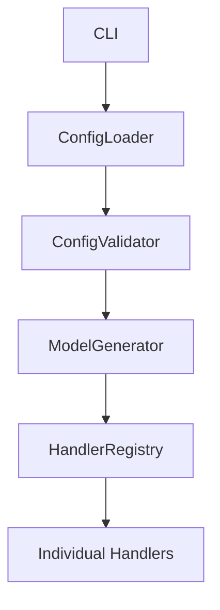
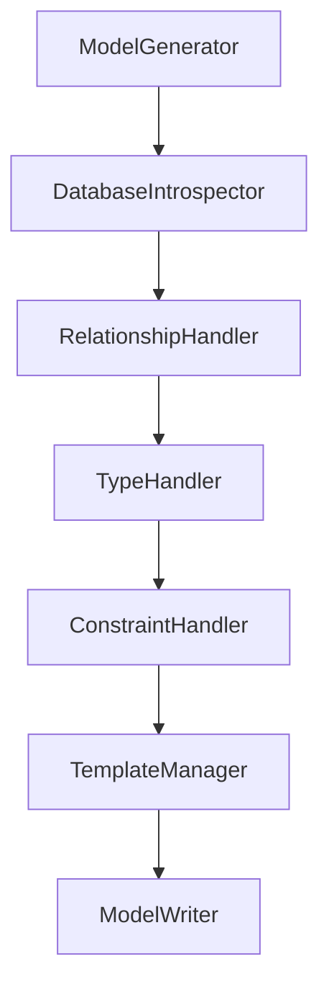
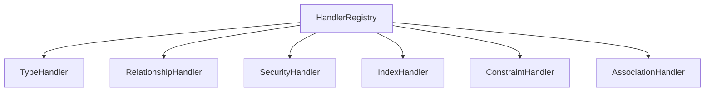
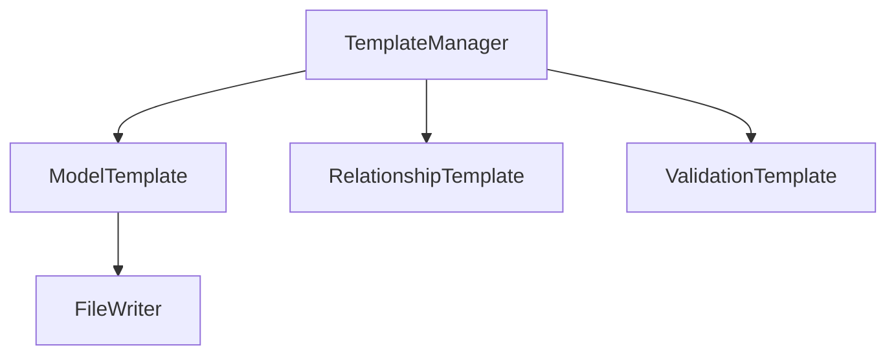
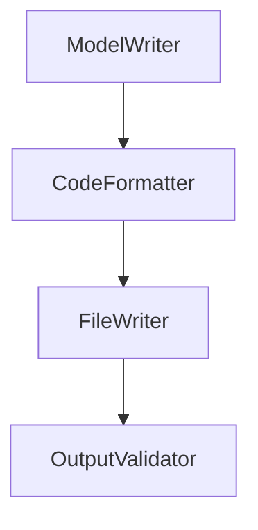

# Component Interactions and Function Signatures

## Component Interaction Patterns

### 1. Configuration Flow


1. **CLI → ConfigLoader**
   ```python
   class ConfigLoader:
       def load(self, config_path: Path) -> GeneratorConfig:
           """Loads and parses configuration file."""

       def merge_with_defaults(self, config: Dict[str, Any]) -> Dict[str, Any]:
           """Merges loaded config with defaults."""

       def validate_config(self, config: GeneratorConfig) -> List[str]:
           """Returns list of validation errors."""
```

2. **ConfigValidator → ModelGenerator**
   ```python
   class ConfigValidator:
       def validate_database_config(self, config: DatabaseConfig) -> List[str]:
           """Validates database configuration section."""

       def validate_generation_config(self, config: GenerationConfig) -> List[str]:
           """Validates generation settings."""

       def validate_relationships_config(self, config: RelationshipsConfig) -> List[str]:
           """Validates relationship configuration."""
```

### 2. Generation Pipeline


1. **ModelGenerator → DatabaseIntrospector**
   ```python
   class ModelGenerator:
       def __init__(self, config: GeneratorConfig):
           self.introspector = DatabaseIntrospector(config.database)
           self.handlers = HandlerRegistry()
           self.writer = ModelWriter(config.output)

       def generate(self) -> None:
           """Main generation process."""

       def process_table(self, table: Table) -> str:
           """Processes a single table."""

       def handle_errors(self, errors: List[Error]) -> None:
           """Handles generation errors."""
```

2. **DatabaseIntrospector → Handlers**
   ```python
   class DatabaseIntrospector:
       def get_schema_info(self) -> SchemaInfo:
           """Returns complete schema information."""

       def analyze_table(self, table_name: str) -> TableInfo:
           """Analyzes a specific table."""

       def get_relationships(self) -> Dict[str, List[RelationshipInfo]]:
           """Returns all relationship information."""

       @dataclass
       class TableInfo:
           name: str
           columns: List[ColumnInfo]
           primary_key: List[str]
           foreign_keys: List[ForeignKeyInfo]
           indices: List[IndexInfo]
           constraints: List[ConstraintInfo]
```

### 3. Handler Interactions


1. **HandlerRegistry → Handlers**
   ```python
   class HandlerRegistry:
       def __init__(self, config: GeneratorConfig):
           """Initialize all handlers."""

       def get_handler(self, handler_type: HandlerType) -> BaseHandler:
           """Returns specific handler instance."""

       def process_table(self, table_info: TableInfo) -> Dict[str, Any]:
           """Processes table through all handlers."""
```

2. **Handler Base Class**
   ```python
   class BaseHandler:
       @abstractmethod
       def validate_config(self) -> List[str]:
           """Validates handler-specific configuration."""

       @abstractmethod
       def process(self, context: GenerationContext) -> None:
           """Processes generation context."""

       @abstractmethod
       def get_imports(self) -> Set[str]:
           """Returns required imports."""
```

3. **Handler Function Signatures**
   ```python
   class TypeHandler(BaseHandler):
       def map_column_type(self, column: ColumnInfo) -> str:
           """Maps database column to Python type."""

       def get_type_options(self, column: ColumnInfo) -> Dict[str, Any]:
           """Returns type-specific options."""

       def handle_custom_type(self, type_name: str) -> str:
           """Handles custom type mapping."""

   class RelationshipHandler(BaseHandler):
       def analyze_relationships(self, table: TableInfo) -> List[RelationshipInfo]:
           """Analyzes table relationships."""

       def detect_cycles(self) -> Set[Tuple[str, str]]:
           """Detects relationship cycles."""

       def generate_relationship_code(self, rel: RelationshipInfo) -> str:
           """Generates relationship code."""

       def resolve_circular_dependency(self, cycle: Tuple[str, str]) -> str:
           """Resolves circular dependencies."""

   class SecurityHandler(BaseHandler):
       def process_sensitive_field(self, column: ColumnInfo) -> str:
           """Handles sensitive field generation."""

       def add_permission_methods(self, context: GenerationContext) -> None:
           """Adds permission methods to model."""

       def generate_security_mixin(self, table: TableInfo) -> str:
           """Generates security mixin code."""
```

### 4. Template Processing


1. **Template Manager**
   ```python
   class TemplateManager:
       def __init__(self, template_dir: Path):
           """Initializes template environment."""

       def render_model(self, context: TemplateContext) -> str:
           """Renders model template."""

       def add_custom_filter(self, name: str, filter_func: Callable) -> None:
           """Adds custom template filter."""

       def extend_template_context(self, **kwargs: Any) -> None:
           """Extends template context."""
```

2. **Template Context**
   ```python
   @dataclass
   class TemplateContext:
       table_info: TableInfo
       relationships: List[RelationshipInfo]
       imports: Set[str]
       config: GeneratorConfig
       handlers_output: Dict[str, Any]

       def get_template_vars(self) -> Dict[str, Any]:
           """Returns template variables."""
```

### 5. Output Generation


1. **Model Writer**
   ```python
   class ModelWriter:
       def write_models(self, models: Dict[str, str]) -> None:
           """Writes generated models to files."""

       def format_code(self, code: str) -> str:
           """Formats generated code."""

       def organize_imports(self, code: str) -> str:
           """Organizes and deduplicates imports."""
```

2. **File Writer**
   ```python
   class FileWriter:
       def write_single_file(self, content: str, path: Path) -> None:
           """Writes all models to a single file."""

       def write_multiple_files(self, models: Dict[str, str]) -> None:
           """Writes models to individual files."""

       def backup_existing(self, path: Path) -> None:
           """Creates backup of existing files."""
```

### Key Data Structures

1. **Generation Context**
   ```python
   @dataclass
   class GenerationContext:
       table_info: TableInfo
       config: GeneratorConfig
       type_map: Dict[str, str]
       relationships: List[RelationshipInfo]
       imports: Set[str]

       def add_import(self, import_stmt: str) -> None:
           """Adds import statement."""

       def add_relationship(self, rel: RelationshipInfo) -> None:
           """Adds relationship information."""
```

2. **Relationship Information**
   ```python
   @dataclass
   class RelationshipInfo:
       source_table: str
       target_table: str
       relationship_type: RelationType
       foreign_keys: List[str]
       backref_name: Optional[str]
       is_nullable: bool
       cascade_options: List[str]
```

3. **Error Handling**
   ```python
   @dataclass
   class GenerationError:
       error_type: ErrorType
       message: str
       table_name: Optional[str]
       column_name: Optional[str]
       stacktrace: Optional[str]

       def format_error(self) -> str:
           """Formats error message."""
```
