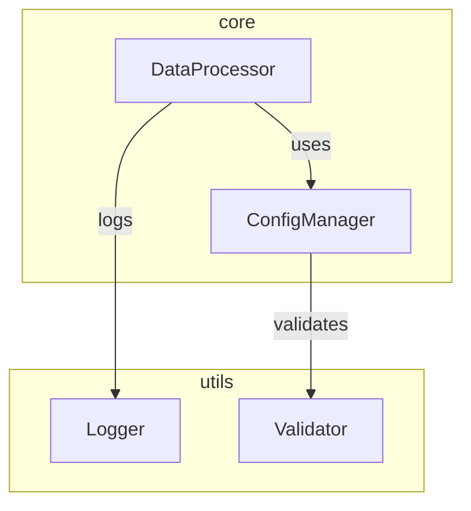

# Advanced Usage Guide - Python Code Refactoring Tool

This guide covers advanced features and techniques for getting the most out of the Python Code Refactoring Tool.

## Table of Contents
- [Comment Preservation](#comment-preservation)
- [Type Hint Management](#type-hint-management)
- [Custom Formatting](#custom-formatting)
- [Dependency Visualization](#dependency-visualization)
- [Error Handling](#error-handling)
- [Incremental Refactoring](#incremental-refactoring)

## Comment Preservation

The tool uses sophisticated strategies to preserve and reattach comments during refactoring.

### Comment Categories

```python
# Stand-alone comment
class ExampleClass:
    """
    Class docstring - preserved with special handling
    """
    
    def example_method(self):
        # Inline method comment
        x = 1  # End-of-line comment
```

### Configuration Options

```yaml
settings:
  comments:
    preserve_all: true
    preserve_docstrings: true
    preserve_inline: true
    preserve_standalone: true
    preserve_structure: true
    reattach_strategy: "context"  # or "position"
```

### Context-Aware Preservation

The tool maintains comment context through refactoring:

```python
# Original code
class DataProcessor:
    # Configuration initialization
    def __init__(self, config):
        self.config = config

# Refactored code - comments preserved with context
class DataProcessor:
    # Configuration initialization
    def __init__(
        self,
        config: Configuration,  # New type hint added
    ) -> None:
        self.config = config
```

### Comment Reattachment Strategies

1. **Context Matching**
```python
def process_data(self, data: List[Dict]):
    # Validate input data structure
    self._validate(data)
    
    # Process each record
    for record in data:
        # Skip empty records
        if not record:
            continue
```

2. **Position-Based**
```python
class ResultHandler:
    def handle_success(self):
        # SUCCESS: Log and return
        logger.info("Success")
        return True

    def handle_error(self):
        # ERROR: Log and raise
        logger.error("Failed")
        raise ProcessingError()
```

## Type Hint Management

### Complex Type Hint Handling

```python
from typing import (
    TypeVar, Generic, List, Dict, Optional,
    Union, Callable, Awaitable, overload
)

T = TypeVar('T')
S = TypeVar('S', bound='BaseSerializer')

class DataProcessor(Generic[T]):
    @overload
    def process(
        self,
        data: List[T],
        config: None = None
    ) -> List[T]: ...
    
    @overload
    def process(
        self,
        data: List[T],
        config: ProcessConfig,
    ) -> Union[List[T], ProcessedResult]: ...
```

### Type Stub Generation

```python
# processor.pyi
from typing import (
    TypeVar, Generic, List, Dict, Optional,
    Union, Protocol, runtime_checkable
)

T_co = TypeVar('T_co', covariant=True)

@runtime_checkable
class Processable(Protocol):
    def process(self) -> None: ...

class DataProcessor(Generic[T_co]):
    def process(
        self,
        data: List[Union[T_co, Processable]],
    ) -> List[T_co]: ...
```

### Type Comment Preservation

```python
# Legacy code with type comments
def process_data(data):
    # type: (List[Dict[str, Any]]) -> ProcessedResult
    pass

# Converted to modern syntax
def process_data(
    data: List[Dict[str, Any]]
) -> ProcessedResult:
    pass
```

## Custom Formatting

### Configuration Options

```yaml
formatting:
  line_length: 88
  string_quotes: "double"  # or "single"
  docstring_style: "google"  # or "sphinx", "numpy"
  indent_style: "space"  # or "tab"
  indent_size: 4
  align_args: true
  align_params: true
  blank_lines:
    before_class: 2
    before_method: 1
    before_docstring: 0
```

### Custom Formatting Rules

```python
# Custom import grouping
imports:
  group_order:
    - "future"
    - "standard_library"
    - "third_party"
    - "first_party"
    - "local"
  separate_groups: true
  align_imports: true

# Method formatting
methods:
  max_length: 50
  max_args: 5
  max_decorators: 3
  chain_style: "wrapped"  # or "aligned"
```

## Dependency Visualization

### Graph Generation Configuration

```yaml
visualization:
  format: "mermaid"  # or "dot", "svg"
  show_types: true
  show_cardinality: true
  cluster_modules: true
  include_external: false
  depth: "full"  # or "module", "direct"
```

### Mermaid Graph Example



### Dependency Analysis Output

```json
{
  "modules": {
    "core": {
      "classes": ["DataProcessor", "ConfigManager"],
      "external_deps": ["logging", "typing"],
      "internal_deps": ["utils.validator", "utils.logger"]
    },
    "utils": {
      "classes": ["Logger", "Validator"],
      "external_deps": ["typing"],
      "internal_deps": []
    }
  },
  "cycles": [],
  "metrics": {
    "modularity": 0.85,
    "coupling": 0.15,
    "cohesion": 0.92
  }
}
```

## Error Handling

### Error Categories and Recovery

```python
try:
    refactorer.process_file(source_file)
except CircularDependencyError as e:
    logger.error(f"Circular dependency detected: {e.cycle}")
    refactorer.suggest_resolution(e.cycle)
    refactorer.rollback()
except InvalidTypeError as e:
    logger.error(f"Invalid type hint: {e.type_hint}")
    refactorer.fix_type_hint(e.type_hint)
    refactorer.retry()
except RefactoringError as e:
    logger.error(f"Refactoring failed: {e}")
    refactorer.generate_error_report()
    refactorer.restore_backup()
```

### Error Recovery Strategies

```yaml
error_handling:
  auto_retry: true
  max_retries: 3
  backup_frequency: "per_module"  # or "per_file", "per_change"
  rollback_strategy: "incremental"  # or "full"
  error_reporting:
    level: "detailed"  # or "summary"
    include_context: true
    save_failed_artifacts: true
```

## Incremental Refactoring

### Change Tracking

```yaml
incremental:
  track_changes: true
  save_state: true
  state_file: ".refactor_state"
  diff_format: "unified"
  backup_modified: true
```

### State Management

```python
# .refactor_state
{
  "version": "1.0",
  "last_successful": "2024-03-15T14:30:00",
  "completed_modules": [
    "utils",
    "core.base"
  ],
  "pending_modules": [
    "core.advanced",
    "services"
  ],
  "modified_files": {
    "core/base.py": "2024-03-15T14:25:00",
    "utils/helpers.py": "2024-03-15T14:28:00"
  },
  "checkpoints": [
    {
      "timestamp": "2024-03-15T14:30:00",
      "hash": "abc123",
      "description": "Completed utils module"
    }
  ]
}
```

### Incremental Refactoring Commands

```bash
# Resume previous refactoring
python refactor.py --resume

# Refactor specific modules
python refactor.py --modules core.base,utils

# Show refactoring status
python refactor.py --status

# Validate current state
python refactor.py --validate

# Create checkpoint
python refactor.py --checkpoint "Completed core module"

# Rollback to checkpoint
python refactor.py --rollback abc123
```

### Progress Tracking

```python
# Progress monitoring output
Refactoring Progress:
[████████████████████░░░░] 80%
Completed:
  ✓ utils (2/2 classes)
  ✓ core.base (3/3 classes)
In Progress:
  ⋯ core.advanced (1/3 classes)
Pending:
  ○ services (0/4 classes)
```

---

This advanced usage guide covers sophisticated features and techniques for handling complex refactoring scenarios. Each section includes practical examples and detailed configuration options.
