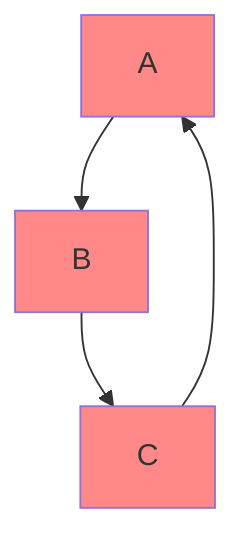

# Core Features Documentation

This document provides a detailed exploration of the core features in the Python Code Refactoring Tool.

## Table of Contents
- [Dependency Analysis](#dependency-analysis)
- [Code Generation](#code-generation)
- [Testing Support](#testing-support)

## Dependency Analysis

The dependency analysis system comprehensively analyzes Python code to understand and manage class relationships, imports, and dependencies.

### Class Relationship Analysis

#### Direct Dependencies
```python
class A:
    def __init__(self, b: 'B'):  # Direct dependency on class B
        self.b = b

class B:
    def process(self) -> None:
        pass
```

The tool identifies several types of relationships:
- **Inheritance**: Class extending another class
- **Composition**: Class containing instance of another class
- **Usage**: Class using methods/attributes of another class
- **Type Dependencies**: Classes referenced in type hints

#### Detection Process
1. AST parsing of source code
2. Analysis of class definitions
3. Method and attribute scanning
4. Type hint evaluation
5. Import statement analysis

### Import Analysis

The tool analyzes imports with support for various import styles:

```python
# Direct imports
import module_name
from module_name import ClassName

# Aliased imports
import module_name as alias
from module_name import ClassName as AliasName

# Multiple imports
from module_name import (
    Class1,
    Class2,
    Class3,
)

# Relative imports
from . import module_name
from ..module_name import ClassName
```

#### Import Resolution Process
1. Collect all import statements
2. Resolve aliases
3. Handle relative imports
4. Map imports to their usage
5. Detect unused imports

### Circular Dependency Detection

The tool uses graph theory to detect and handle circular dependencies:



#### Detection Algorithm
1. Build dependency graph
2. Perform topological sort
3. Identify cycles
4. Generate detailed cycle reports
5. Suggest remediation strategies

Example cycle detection output:
```python
{
    "cycle_type": "direct",
    "components": ["ClassA", "ClassB", "ClassC"],
    "paths": [
        "ClassA -> ClassB -> ClassC -> ClassA"
    ],
    "remediation": "Consider dependency injection"
}
```

### Type Hint Analysis

Comprehensive analysis of type hints including:

```python
from typing import List, Dict, Optional, Union, TypeVar

T = TypeVar('T')

class DataProcessor:
    def process(
        self,
        data: List[Dict[str, Any]],
        config: Optional[Config] = None
    ) -> Union[ProcessedData, ErrorResult]:
        pass
```

#### Type Analysis Features
- Generic type support
- Union and Optional types
- Type variable handling
- Forward references
- Complex nested types

### Async Dependency Support

Detection and handling of asynchronous code:

```python
class AsyncProcessor:
    async def process_data(self, data: Data) -> Result:
        result = await self.sub_process(data)
        return result

    async def sub_process(self, data: Data) -> Result:
        # Processing logic
        pass
```

#### Async Analysis Features
- Async function detection
- Await expression analysis
- Async context management
- Concurrent operation patterns
- Async dependency graphs

## Code Generation

### Module Structure Generation

The tool generates a standardized module structure:

```
project_name/
├── src/
│   ├── module_1/
│   │   ├── __init__.py
│   │   ├── class_1.py
│   │   └── class_2.py
│   └── module_2/
│       ├── __init__.py
│       └── class_3.py
├── tests/
├── docs/
└── setup.py
```

#### Generation Rules
1. Modules are created based on configuration
2. Each class gets its own file
3. Proper `__init__.py` files are generated
4. Import statements are optimized
5. Package hierarchy is maintained

### Package Hierarchy Rules

```python
# __init__.py
"""Module description"""

from .class_1 import Class1
from .class_2 import Class2

__all__ = ['Class1', 'Class2']
```

#### Package Structure Rules
1. Clear module boundaries
2. Explicit exports
3. Proper namespace handling
4. Version management
5. Module documentation

### Type Stub Generation

The tool generates comprehensive type stubs (.pyi files):

```python
# processor.pyi
from typing import List, Dict, Optional, TypeVar
from .types import Data, Result

T = TypeVar('T')

class DataProcessor:
    def __init__(self, config: Optional[Config] = ...) -> None: ...
    def process(self, data: List[Dict[str, T]]) -> Result[T]: ...
    async def process_async(self, data: Data) -> Result: ...
```

#### Stub Generation Features
- Complete type information
- Function signatures
- Class hierarchies
- Async function support
- Generic type handling

### Documentation Generation

Generates comprehensive documentation using Sphinx:

```python
class DataProcessor:
    """
    Process data according to configured rules.

    Args:
        config (Optional[Config]): Configuration settings
        
    Raises:
        ValueError: If configuration is invalid
        ProcessError: If processing fails
        
    Examples:
        >>> processor = DataProcessor()
        >>> result = processor.process(data)
    """
```

#### Documentation Features
- API documentation
- Usage examples
- Type information
- Exception documentation
- Cross-references

### License Header Handling

Manages license headers across generated files:

```python
# Copyright (c) 2024 Organization Name
# Licensed under the MIT License
# See LICENSE file in the project root for full license text

"""Module docstring."""

import typing
```

#### License Management Features
- Template-based headers
- License validation
- Header consistency
- Multiple license support
- Year updates

## Testing Support

### Test File Generation

Generates comprehensive test files:

```python
import pytest
from unittest.mock import Mock, patch
from mypackage.processor import DataProcessor

class TestDataProcessor:
    @pytest.fixture
    def processor(self):
        return DataProcessor()

    def test_process_valid_data(self, processor):
        # Test implementation
        pass

    def test_process_invalid_data(self, processor):
        # Test implementation
        pass
```

#### Test Generation Features
- Class-based tests
- Individual method tests
- Error case testing
- Integration tests
- Property-based tests

### Fixture Generation

Generates pytest fixtures for dependencies:

```python
@pytest.fixture
def mock_database():
    """Fixture for database dependency."""
    with patch('mypackage.database.Database') as mock:
        mock.connect.return_value = True
        yield mock

@pytest.fixture
def mock_config():
    """Fixture for configuration."""
    return {
        'setting1': 'value1',
        'setting2': 'value2'
    }
```

#### Fixture Features
- Resource management
- Mock integration
- Dependency injection
- Cleanup handling
- Factory fixtures

### Mock Creation

Sophisticated mock generation:

```python
@pytest.fixture
def mock_api_client():
    with patch('mypackage.api.Client') as mock:
        mock.get.return_value = Mock(
            status_code=200,
            json=lambda: {'data': 'test'}
        )
        mock.post.side_effect = lambda *args, **kwargs: Mock(
            status_code=201,
            json=lambda: {'id': 'created'}
        )
        yield mock

def test_api_interaction(mock_api_client):
    # Test implementation using mock
    pass
```

#### Mocking Features
- Method mocking
- Return value configuration
- Side effect handling
- Mock verification
- Mock chaining

### Edge Case Handling

Generates tests for edge cases:

```python
@pytest.mark.parametrize('invalid_input', [
    None,
    '',
    [],
    {'invalid': 'structure'},
    object(),
])
def test_invalid_inputs(processor, invalid_input):
    with pytest.raises(ValueError):
        processor.process(invalid_input)

@pytest.mark.parametrize('edge_case', [
    pytest.param(
        {'extreme': 'value'},
        id='extreme_value'
    ),
    pytest.param(
        {'boundary': 'condition'},
        id='boundary_condition'
    ),
])
def test_edge_cases(processor, edge_case):
    # Test implementation
    pass
```

#### Edge Case Features
- Boundary testing
- Error conditions
- Invalid inputs
- Resource limits
- Race conditions

### Async Test Support

Comprehensive async test support:

```python
import pytest
import asyncio

class TestAsyncProcessor:
    @pytest.fixture
    async def async_processor(self):
        processor = AsyncProcessor()
        await processor.initialize()
        yield processor
        await processor.cleanup()

    @pytest.mark.asyncio
    async def test_async_process(self, async_processor):
        result = await async_processor.process_data(test_data)
        assert result.status == 'success'

    @pytest.mark.asyncio
    async def test_concurrent_processing(self, async_processor):
        tasks = [
            async_processor.process_data(data)
            for data in test_dataset
        ]
        results = await asyncio.gather(*tasks)
        assert all(r.status == 'success' for r in results)
```

#### Async Testing Features
- Async fixture support
- Concurrent testing
- Resource cleanup
- Timeout handling
- Error propagation

---

This documentation covers the core features of the refactoring tool. Each section includes practical examples and detailed explanations of the functionality provided.
