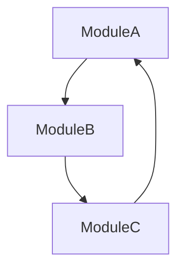

# Troubleshooting Guide

This guide provides solutions for common issues encountered while using the Python Code Refactoring Tool.

## Table of Contents
- [Common Errors](#common-errors)
- [Validation Failures](#validation-failures)
- [Dependency Cycles](#dependency-cycles)
- [Permission Issues](#permission-issues)
- [Recovery Procedures](#recovery-procedures)

## Common Errors

### ConfigurationError: Invalid YAML Structure

**Error Message:**
```
ConfigurationError: Failed to parse configuration file: mapping values are not allowed here at line 3, column 15
```

**Solution:**
1. Check YAML indentation
2. Validate YAML syntax
3. Example of correct format:
```yaml
modules:
  core:
    description: "Core functionality"
    classes:
      - MainClass
    dependencies:
      - utils
```

### ModuleNotFoundError: Unable to Import Required Module

**Error Message:**
```
ModuleNotFoundError: No module named 'networkx'
```

**Solution:**
1. Install missing dependencies:
```bash
pip install -r requirements.txt
```

2. Verify Python environment:
```bash
python -m pip list
python -m pip check
```

### SyntaxError: Invalid Python Syntax

**Error Message:**
```
SyntaxError: invalid syntax at line 45 in file processor.py
```

**Diagnostic Steps:**
1. Check Python version compatibility
2. Verify source code syntax
3. Look for common issues:
```python
# Common syntax issues and their fixes

# 1. Missing parentheses in print (Python 3)
# Wrong:
print "Hello"
# Correct:
print("Hello")

# 2. Invalid f-string syntax
# Wrong:
f"Value: {value:2.f}"
# Correct:
f"Value: {value:.2f}"

# 3. Async/await syntax
# Wrong:
async function get_data():
# Correct:
async def get_data():
```

## Validation Failures

### Type Validation Errors

**Error:**
```
TypeValidationError: Invalid type hint found in class DataProcessor
```

**Resolution Steps:**
1. Check type hint syntax:
```python
# Wrong:
def process(data: list[str]) -> none:
    pass

# Correct:
from typing import List
def process(data: List[str]) -> None:
    pass
```

2. Verify type imports:
```python
from typing import (
    List, Dict, Optional,
    Union, Any, Callable
)
```

### Module Structure Validation

**Error:**
```
ModuleValidationError: Invalid module structure detected
```

**Checklist:**
1. Verify module hierarchy
```
project/
├── core/
│   ├── __init__.py
│   └── processor.py
├── utils/
│   ├── __init__.py
│   └── helpers.py
└── setup.py
```

2. Check import statements:
```python
# Correct relative imports
from ..utils import helpers
from .processor import DataProcessor
```

## Dependency Cycles

### Direct Circular Dependencies

**Error:**
```
CircularDependencyError: Circular dependency detected between ModuleA and ModuleB
```

**Solution Strategies:**

1. **Extract Common Interface:**
```python
# Before
class ModuleA:
    def __init__(self):
        self.b = ModuleB()

class ModuleB:
    def __init__(self):
        self.a = ModuleA()

# After
from abc import ABC, abstractmethod

class Interface(ABC):
    @abstractmethod
    def process(self):
        pass

class ModuleA(Interface):
    def process(self):
        pass

class ModuleB(Interface):
    def process(self):
        pass
```

2. **Use Dependency Injection:**
```python
# Before
class ServiceA:
    def __init__(self):
        self.b = ServiceB()

# After
class ServiceA:
    def __init__(self, service_b=None):
        self.b = service_b or ServiceB()
```

### Complex Dependency Chains

**Error:**
```
ComplexDependencyError: Unable to resolve dependency chain: A -> B -> C -> A
```

**Visualization and Resolution:**


**Resolution Steps:**
1. Identify the cycle
2. Break dependencies:
```python
# Create intermediate module
class DependencyManager:
    def __init__(self):
        self.modules = {}
    
    def register(self, name, module):
        self.modules[name] = module
    
    def get_module(self, name):
        return self.modules.get(name)
```

## Permission Issues

### File Access Denied

**Error:**
```
PermissionError: [Errno 13] Permission denied: '/path/to/output'
```

**Resolution Steps:**
1. Check file permissions:
```bash
ls -la /path/to/output
```

2. Modify permissions if needed:
```bash
chmod 755 /path/to/output
```

3. Verify user permissions in code:
```python
def verify_permissions(path: Path):
    if not os.access(path, os.W_OK):
        raise PermissionError(f"No write access to {path}")
```

### Directory Creation Failures

**Error:**
```
OSError: Cannot create directory '/path/to/output/module'
```

**Resolution:**
1. Verify parent directory permissions
2. Check directory existence:
```python
def ensure_directory(path: Path):
    try:
        path.mkdir(parents=True, exist_ok=True)
    except PermissionError:
        raise PermissionError(f"Cannot create directory: {path}")
```

## Recovery Procedures

### Automated Recovery

**Usage:**
```python
try:
    refactorer.process()
except RefactoringError as e:
    recovery = RecoveryManager()
    recovery.attempt_recovery(e)
```

### Manual Recovery Steps

1. **Restore from Backup:**
```bash
# Restore latest backup
python refactor.py --restore-backup latest

# Restore specific backup
python refactor.py --restore-backup backup_20240327_123456
```

2. **Verify Project State:**
```bash
# Check project integrity
python refactor.py --verify

# Run validation tests
python refactor.py --validate
```

3. **Resume Refactoring:**
```bash
# Resume from last checkpoint
python refactor.py --resume

# Force clean start
python refactor.py --clean-start
```

### Recovery Logging

Recovery operations are logged for debugging:
```python
def log_recovery_attempt(self, error: Exception):
    """Log recovery operation details."""
    log_entry = {
        'timestamp': datetime.now().isoformat(),
        'error': str(error),
        'recovery_steps': [],
        'result': None
    }
    
    try:
        # Attempt recovery steps
        for step in self.recovery_steps:
            result = step()
            log_entry['recovery_steps'].append({
                'step': step.__name__,
                'result': result
            })
        
        log_entry['result'] = 'success'
        
    except Exception as e:
        log_entry['result'] = 'failure'
        log_entry['failure_reason'] = str(e)
    
    self._write_recovery_log(log_entry)
```

### Emergency Procedures

For catastrophic failures:

1. Stop all refactoring operations
```python
refactorer.emergency_stop()
```

2. Create emergency backup
```python
backup_manager.create_emergency_backup()
```

3. Generate diagnostic report
```python
diagnostics = DiagnosticsManager()
report = diagnostics.generate_emergency_report()
```

---

This troubleshooting guide covers common issues and their solutions when using the refactoring tool. For issues not covered here, please consult the full documentation or open an issue in the project repository.
